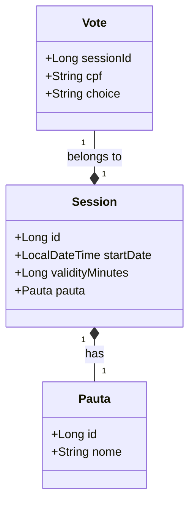

# Sistemas de votação em pautas
Java restful API criado para a Sistemas de votação
## Diagrama de Classes

```mermaid
classDiagram
    class Pauta {
        +Long id
        +String nome
    }

    class Session {
        +Long id
        +LocalDateTime startDate
        +Long validityMinutes
        +Pauta pauta
    }

    class Vote {
        +Long sessionId
        +String cpf
        +String choice
    }

    Session "1" *-- "1" Pauta : has
    Vote "1" --* "1" Session : belongs to
```
